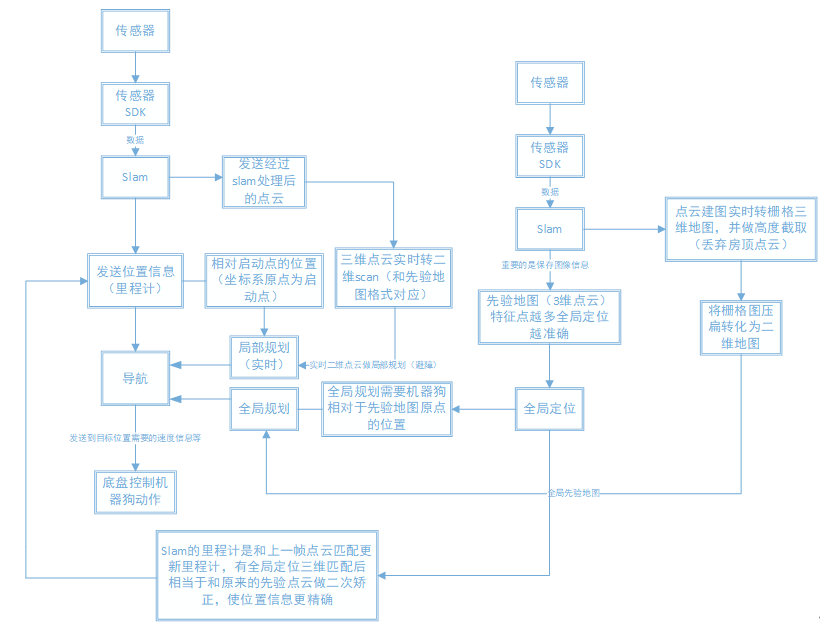
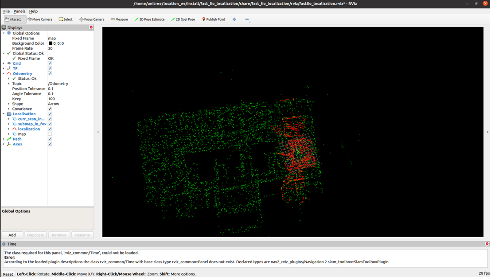
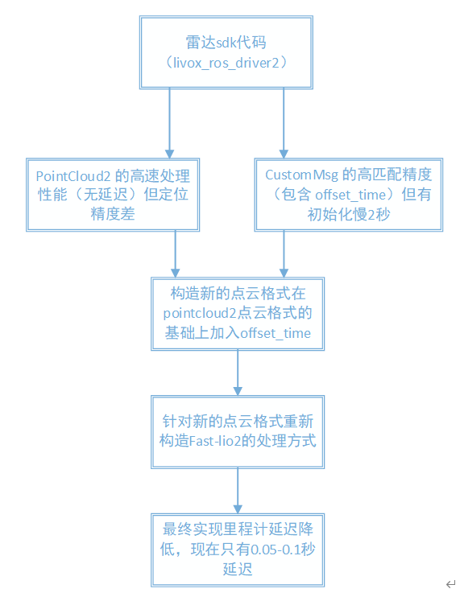

# 宇树Go2四足机器人自主导航系统

基于ROS2的多传感器融合四足机器人自主导航系统，实现实时定位、路径规划与动态避障功能。

---

## 一、系统整体框架

本系统采用分层架构设计，主要包含三大核心模块：

```
┌─────────────────────────────────────────────────────────────────┐
│                      用户交互层 (RVIZ2)                          │
│         地图可视化 | 目标点设置 | 状态监控 | TF树查看              │
└─────────────────────────────────────────────────────────────────┘
                                │
┌─────────────────────────────────────────────────────────────────┐
│                      导航规划层 (Nav2)                           │
│    全局规划 │ 局部规划(TEB) │ 代价地图 │ 行为控制 │ 恢复策略        │
└─────────────────────────────────────────────────────────────────┘
                                │
┌─────────────────────────────────────────────────────────────────┐
│                    定位建图层 (FAST-LIO2)                        │
│      点云处理 │ ICP配准 │ IMU融合 │ PCD地图加载 │ 初始位姿估计     │
└─────────────────────────────────────────────────────────────────┘
                                │
┌─────────────────────────────────────────────────────────────────┐
│                      传感器驱动层                                │
│           激光雷达 │ 深度相机 │ IMU │ 里程计                      │
└─────────────────────────────────────────────────────────────────┘
```



---

## 二、核心模块详解

### 2.1 传感器融合模块

系统整合多种传感器数据：

| 传感器 | 作用 | 数据话题 |
|--------|------|----------|
| 激光雷达 | 环境感知、障碍物检测 | `/scan` |
| 点云 | 稠密深度信息 | `/livox/lidar` |
| IMU | 姿态测量、运动预测 | `/livox/imu` |
| 里程计 | 相对运动估计 | `/odometry` |

### 2.2 SLAM定位模块 (FAST-LIO2)

基于迭代最近点(ICP)算法实现全局重定位：



**关键流程：**
1. 接收激光扫描数据并转为点云
2. 使用体素滤波降采样，减少计算量
3. ICP算法匹配当前点云与参考地图
4. 输出6DOF位姿估计结果

### 2.3 导航规划模块 (Nav2)

采用TEB局部规划器，适合四足机器人运动特点：

```
全局代价地图 ──→ 全局路径规划 (Nav2/A*) ──→ 全局路径
                        ↑
                        │
实时代价地图 ──→ 局部轨迹优化 (DWA) ──→ 局部轨迹 ──→ 运动控制
      │                                                    │
      ↓                                                    ↓
   障碍物信息                                        速度指令
```

**DWA规划器优势：**
- 适合低速运动的足式机器人
- 对TF转换要求较低
- 动态避障稳定性好

---

## 三、系统工作流程



### 3.1 建图阶段

1. 启动SLAM节点，控制机器人在环境中行走
2. RVIZ2实时查看scan话题和建图结果
3. 地图构建完成后，使用map_saver保存(NAV2工具)

```bash
# 保存为png格式（推荐）
ros2 run nav2_map_server map_saver_cli -f <保存路径>/nav_map --fmt png

# 或保存为pgm格式
ros2 run nav2_map_server map_saver_cli -f <保存路径>/nav_map
```

### 3.2 定位阶段

1. 启动定位节点，加载预构建的PCD地图
2. 等待绿色轮廓（地图匹配成功）
3. 使用"2D Pose Estimate"设定初始位姿

```bash
# 加载点云地图
ros2 launch fast_lio_localization localization.launch.py \
    pcd_map_topic:=cloud_pcd \
    map:=<地图路径>/地图名.pcd
```

### 3.3 导航阶段

1. 在RVIZ2中添加代价地图显示
2. 使用"2D Goal Pose"设定目标点
3. 系统自动规划路径并执行避障导航

---

## 四、关键技术要点

### 4.1 TF坐标系管理

```
map ──→ odom ──→ base_link ──→ 传感器坐标系
```

- 建图时发布map→odom变换
- 导航时保持TF树稳定
- 注意控制TF发布频率，避免资源占用

### 4.2 全局地图处理

使用图像编辑工具(GIMP/Photoshop)修改地图：
- 标注动态障碍物位置
- 移除已清除的障碍物
- 补充缺失的环境信息

### 4.3 初始位姿估计

初始位姿准确度直接影响ICP配准效果：

```bash
# 命令行方式设置
ros2 run fast_lio_localization publish_initial_pose.py x y z roll pitch yaw

# 示例：在(1, 0.1, 0.3)位置设置初始位姿
ros2 run fast_lio_localization publish_initial_pose.py 1 0.1 0.3 0 0 0
```

---

## 五、视频演示（点击直接播放）

视频演示页面部署在 GitHub Pages，可直接在浏览器中播放：

**👉 [前往演示页面](https://busyflag.github.io/Navigation-System-for-Quadruped-Robots/)**

演示内容包括：
- 实时避障演示 - 动态障碍物环境中的避障能力
- 自主导航演示 - 全流程无人工干预导航

---

## 六、总结

本系统通过以下设计实现四足机器人的稳定自主导航：

| 特性 | 实现方式 | 效果 |
|------|----------|------|
| 高精度定位 | ICP点云配准 | 亚分米级定位精度 |
| 实时避障 | DWA局部规划 | 动态障碍物响应<1s |
| 低速稳定 | DWA参数优化 | 适合足式运动特点 |
| 地图适配 | 全局地图编辑 | 适应复杂环境 |

---

<p align="center">
  <strong>宇树Go2自主导航系统</strong><br>
  基于ROS2的智能导航解决方案
</p>
